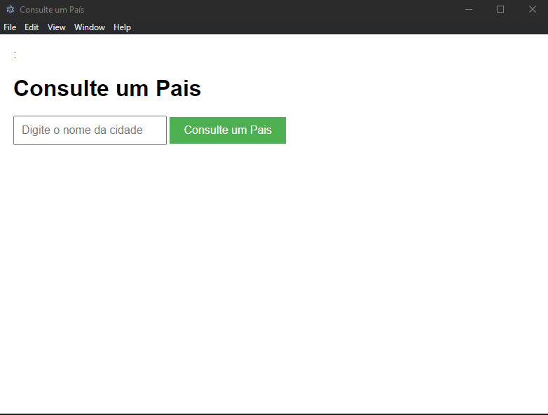

# Trabalho de Sistemas Digitais - PUC campus Poços de Caldas

Este é um projeto feito para o trabalho de Sistemas Digitais, 
no qual tem o objetivo de implementar uma aplicação cliente que 
utilize algum serviço WEB que forneça uma API.

A API usada para este projeto foi a API *REST Countries API*,
na qual retorna dados de um país.

Neste projeto foi utilizado a linguagem JavaScript com o framework Electron,
além de HTML e CSS para retornar os resultados.

## Guia de como rodar a aplicação

Para rodar a aplicação primeiro é necessário ter o Node instalado,
se você tem o node instalado, basta baixar a pasta compactada (.zip),
extrair o que tem nela, abrir o terminal e rodar os comandos:
```npm install```
para fazer o download dos pacotes necessários, e depois rodar o comando:
```npx electron .```
com isso ele abrira uma janela parecida com essa:


E então pesquise um pais para encontrar informações sobre ele.